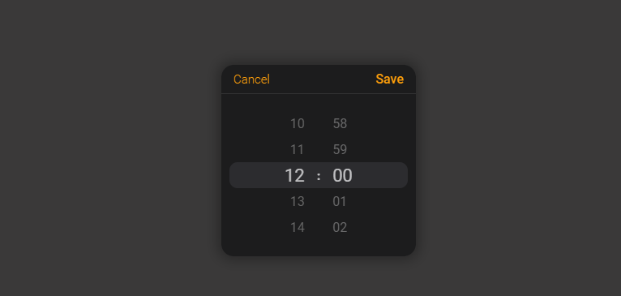

[](https://www.npmjs.com/package/hidden-meddarhri-test) 

# React ios time picker



A modern time picker for your next React app.

-  Supports virtually any language
-  No moment.js needed
-  Zero dependencies and lightweight

## install

```
npm install react-ios-time-picker
```

## Usage

```js
import React, { useState } from 'react';
import { TimePicker } from 'react-ios-time-picker';

export default const  MyApp = () => {
   const [value, setValue] = useState('10:00');

   const onChange = (timeValue) => {
      setValue(timeValue);
   }

   return (
      <div>
         <TimePicker onChange={onChange} value={value} />
      </div>
   );
}
```

## API

| Name               | Type                                          | Default        | Description                                                     |
| ------------------ | --------------------------------------------- | -------------- | --------------------------------------------------------------- |
| value              | String                                        | n/a            | Current value.                                                  |
| cellHeight         | Number                                        | 35             | The height of the cell number.                                  |
| placeHolder        | String                                        | `"Selet_time"` | Time input's placeholder.                                       |
| pickerDefaultValue | String                                        | `"00:00"`      | The initial value that the picker begin with in the first time. |
| disabled           | Boolean                                       | `false`        | Whether picker is disabled.                                     |
| isOpen             | Boolean                                       | `false`        | Whether the time picker should be opened.                       |
| required           | Boolean                                       | `false`        | Whether time input should be required.                          |
| cancelButtonText   | String                                        | `"Cancel"`     | Cancel button text content                                      |
| saveButtonText     | String                                        | `"Save"`       | Save button text content                                        |
| controllers        | Boolean                                       | `true`         | Whether the buttons should be displayed                         |
| seperator          | Boolean                                       | `true`         | whether show the colon seperator                                |
| id                 | String                                        | n/a            | Input time picker id                                            |
| onChange           | `(value) => alert ('New time is: ', value)`   | n/a            | Called when select a different value                            |
| onSave             | `(value) => alert ('Time saved is: ', value)` | n/a            | When the user clicks on save button                             |
| onClose            | `() => alert('Clock closed')`                 | n/a            | When the user clicks on cancel button                           |

## Contributions Welcome!

```shell
git clone https://github.com/MEddarhri/react-ios-time-picker
cd react-ios-time-picker
```

## License

The MIT License.
